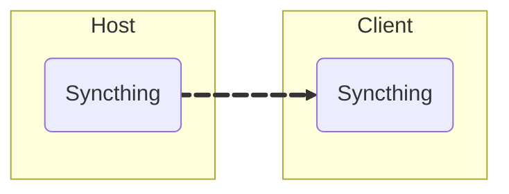

```mermaid
    graph LR;

    %% --- Host Containers --- %%
    subgraph Host[Host]
        HostSyncthing(Syncthing)
    end
    %% ----------------------- %%


    %% --- Client Containers -- %%

    subgraph Client[Client]
        ClientSyncthing(Syncthing)
    end
    %% ----------------------- %%

    %% --- Routing --- %%
    HostSyncthing animation1@==>ClientSyncthing
    animation1@{ animate: true, animation: slow }
    %% ----------------------- %%
```